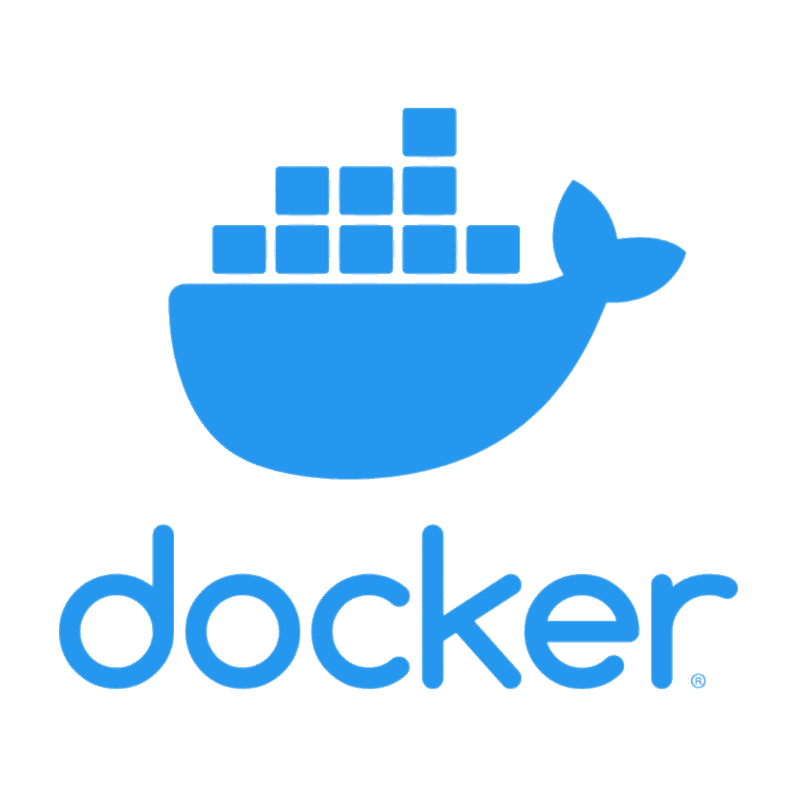

# Docker for Codex

A marketplace-ready Codex plugin for the complete container lifecycle: development, security, release, deployment, and operations.



## Features

1. **Project-aware containerization** — detect runtimes, frameworks, lockfiles, monorepos, Docker assets, and CI.
2. **Compose stack generation** — create application stacks with optional PostgreSQL and Redis services.
3. **Docker security auditing** — flag privileged mode, socket mounts, root users, dangerous capabilities, secrets, and unsafe networking.
4. **Image optimization** — guide multi-stage builds, cache ordering, dependency pruning, base-image selection, and narrow contexts.
5. **Dockerfile linting** — plan Hadolint checks and contextual remediation.
6. **Compose validation** — resolve and validate Compose configuration before execution.
7. **Container smoke tests** — plan or execute isolated service tests with bounded logs and volume-safe cleanup.
8. **Failure diagnosis** — investigate builds, startup, networking, storage, architecture, health, and resource failures.
9. **Supply-chain scanning** — support Trivy, Docker Scout, and Grype workflows.
10. **SBOM generation** — generate SPDX or CycloneDX inventories with Syft or Trivy.
11. **Secret scanning** — inspect source contexts, image configuration, and layers, with credential-rotation guidance.
12. **BuildKit workflows** — use secret, SSH, and cache mounts, remote caches, provenance, and attestations.
13. **Multi-platform builds** — plan AMD64/ARM64 buildx releases and distinguish cross-builds from native tests.
14. **Registry workflows** — cover Docker Hub, GHCR, ECR, Google Artifact Registry, and ACR.
15. **CI/CD generation** — create pull-request build validation and protected release publishing.
16. **Image signing** — sign and verify immutable digests with Cosign and explicit trust policies.
17. **Kubernetes migration** — translate Compose concepts into secure Deployment, Service, storage, probe, and Helm patterns.
18. **Development containers** — generate non-root `.devcontainer` starters for VS Code and Codespaces.
19. **Framework recipes** — cover Next.js, Django, FastAPI, Rails, Spring Boot, Go, and Rust production builds.
20. **Database migrations** — plan locked, one-off, rollback-aware migration jobs.
21. **Backup and restore** — plan PostgreSQL, MySQL, and Redis operations with isolated restore drills.
22. **Resource tuning** — tune CPU, memory, shutdown, restart, logging, and storage from measurements.
23. **Observability** — design structured logging, metrics, OpenTelemetry, Prometheus, and Grafana stacks.
24. **Environment reporting** — inspect Docker, Compose, buildx, architecture, disk usage, and optional tooling.
25. **Deterministic helpers** — provide reusable, non-executing planners and guarded local testing tools.

## Skills

| Skill | Focus |
|---|---|
| `docker-workflows` | Detection, Dockerfiles, Compose, optimization, smoke tests, diagnosis, and CI starters |
| `docker-supply-chain` | Linting, secrets, CVEs, SBOMs, signing, verification, and policy |
| `docker-release` | BuildKit, buildx, registries, multi-platform publishing, caches, and release CI |
| `docker-platforms` | Framework recipes, devcontainers, Kubernetes, and Helm migration |
| `docker-operations` | Migrations, backups, restores, resources, environment health, and observability |

## Installation

Clone the repository:

```bash
git clone https://github.com/azevedomedia0/codex-docker-plugin.git
```

Then add the cloned plugin through Codex. The plugin manifest is `.codex-plugin/plugin.json`, and skills are discovered from `skills/`.

## Example prompts

- `Detect this project's stack and create a production Dockerfile and Compose stack.`
- `Audit this image, generate an SBOM, scan it, and plan Cosign verification.`
- `Create a multi-platform GHCR release workflow with provenance.`
- `Convert this Compose service into Kubernetes and a devcontainer.`
- `Plan a PostgreSQL migration, backup drill, resource limits, and observability stack.`

## Safety model

Helpers default to read-only inspection or dry-run plans. Docker execution requires explicit flags. Registry pushes, signing, restores, destructive migrations, pruning, and volume deletion require explicit authorization and exact targets.

## Validation

```bash
python3 scripts/validate.py
python3 -m unittest discover -s tests -v
```

The repository validator checks manifests, semantic versioning, referenced skill resources, Python syntax, metadata, and placeholder content. GitHub Actions runs it on every push and pull request.

## Contributing

Read [CONTRIBUTING.md](CONTRIBUTING.md) before opening a pull request. Report vulnerabilities through the process in [SECURITY.md](SECURITY.md).

## License

Licensed under the [MIT License](LICENSE).
